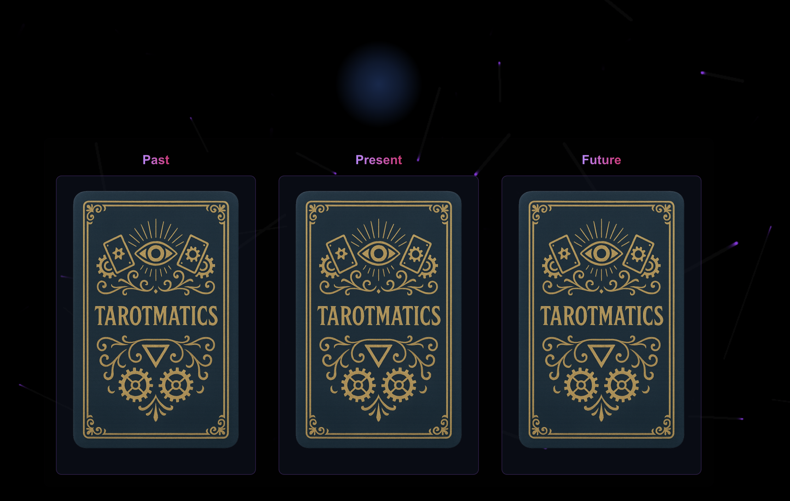

# Tarotmatics (for Hackmatics at Speechmatics)



Tarotmatics is a personalized Tarot card reader:
- Open the app and answer Fortuna's questions (ensure you have a working Mic). 
- Fortuna will generate three fitting tarot cards with personalised artwork.
- Fortuna will then produce an interpretation of the cards, tailored to your unique situation and responses.

To get it running, first clone the repo and replicate the environment:
```bash
git clone https://github.com/knottwill/Tarotmatics.git
cd Tarotmatics/main
pnpm install
```

You will need a Flow API key from the [Speechmatics Portal](https://portal.speechmatics.com/dashboard), a stable diffusion API key, and an open ai API key. Copy the example file and fill in the API keys:

```bash
cp .env.example .env
```

```.env
API_KEY=
STABLE_DIFFUSION_API_KEY=
OPENAI_API_KEY=
```

Finally, run the app and have your fortunes revealed:

```bash
pnpm dev
```